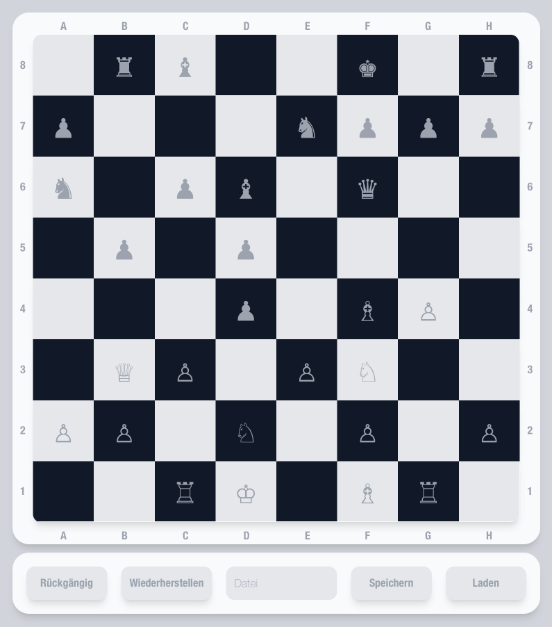

# HTWG Chess - A Chess Game in Scala 3

 

## Overview

HTWG Chess is a chess game developed in Scala 3, designed as part of the Software Engineering curriculum at HTWG Konstanz. It features a robust GUI optimized for Mac M1 and supports Docker for cross-platform compatibility.

## Getting Started

### Prerequisites

- Scala 3
- sbt
- Docker (optional, for non-Mac M1 users)
- xQuartz (for Mac users running Docker)

### Installation and Execution

#### Running Locally

1. Clone the repository.
2. Navigate to the project directory.
3. To compile the code, run `sbt compile`.
4. Start the game with `sbt run`.
5. To open a Scala 3 REPL, use `sbt console`.

#### Using Docker

1. Build the Docker image: `docker build -t chess:v1 .`
2. Run the container: `docker run -it -e DISPLAY=192.168.0.112:0 -v /tmp/.X11-unix:/tmp/.X11-unix --name chess chess:v1`
   - Note: Replace `192.168.0.112` with your local IP address.

### Testing

The project is fully tested with unit tests. To run the tests and generate a coverage report:

1. Execute `sbt clean coverage test coverageReport`.
2. View the report in the generated `target/scala-3.x.x/scoverage-report/index.html`.

### Additional Information

For more details on Scala 3 and sbt, see the [scala3-example-project](https://github.com/scala/scala3-example-project/blob/main/README.md).
